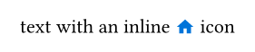
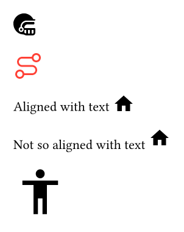
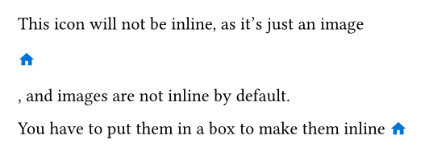

<picture>
  <source media="(prefers-color-scheme: dark)" srcset="./thumbnail-dark.svg">
  
</picture>

Use all of Iconify icons. Browse all the icons at [icones.js.org](https://icones.js.org). Supports Typst 0.13 and above.

## Overview

`iconify` loads icons from Iconify JSON collections and gives you back an icon image.

```typ
#import "@preview/iconify:0.4.1": icon

#set page(height: auto, width: auto, margin: 1em)

text with an inline #icon("mdi:home", color: blue, width: 1em, y: -0.2em) icon
```

Result:



## Usage

### `icon`

Most of the time, you will want to use the `icon` function, which gives directly an inline image.

```typ
#import "@preview/iconify:0.4.1": icon

#set page(height: auto, width: auto, margin: 1em)

// Basic usage
#icon("streamline-ultimate:american-football-helmet-bold")

// With color
#icon("carbon:3d-curve-auto-colon", color: red)

// you can adjust the vertical position of the icon with the `y` parameter, for example to align it better with the text baseline:
Aligned with text #icon("mdi:home", y: -0.3em)

Not so aligned with text #icon("mdi:home")

// The other parameters are passed to the image, so you can adjust the size of the icon with `width` and/or `height`:
#icon("bx:body", width: 4em)
```

Result:



### `icon-svg`

If you need more control over the SVG, you can get it directly with the `icon-svg` function, which gives you back the raw SVG string. You can then use it in an `image` block or manipulate it as you want. Note that before passing it to an image, you'll want to convert it to `bytes`, and pass the `format: "svg"` parameter to the image, otherwise it won't be rendered correctly.

```typ
#import "@preview/iconify:0.4.1": icon

#set page(height: auto, width: auto, margin: 1em)

#image(bytes(icon-svg("mdi:home", color: blue)), format: "svg")
```

Result:


### `block-icon`

If you want the image, but do not care about it being inline, you can use the `block-icon` function, which gives you a raw image. It has an identical API to `icon`, but does not apply the vertical offset.

```typ
#import "@preview/iconify:0.4.1": icon

#set page(height: auto, width: auto, margin: 1em)

This icon will not be inline, as it's just an image #block-icon("mdi:home", color: blue, width: 1em), and images are not inline by default.

You have to put them in a box to make them inline #box(#block-icon("mdi:home", color: blue, width: 1em), inset: (y: -0.2em))
```

Result:



## Attributions

All of these icons are free, but some require attribution. Please check the license of the icons you use on [icones.js.org](https://icones.js.org) and give proper attribution if required.

## Thanks

This project is a small wrapper on the shoulder of these giants:

- [Iconify](https://iconify.design/) for the icons and the JSON format.
- [icones.js.org](https://icones.js.org/) for the search engine.

## Development

You'll need the [Just](https://just.systems/) test runner. See the [Justfile](./Justfile) or run `just` without arguments for the available commands.

# License

MIT License. See [LICENSE.MIT](./LICENSE.MIT) for more details.
